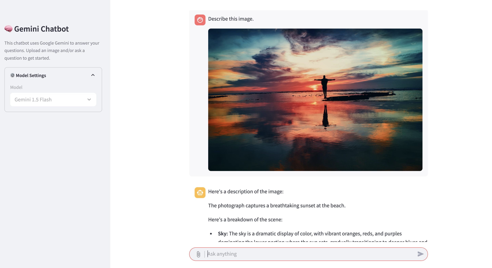

# Gemini Chatbot
A Streamlit-based chatbot that uses Google Gemini to respond to both **textual queries** and **image uploads**. Ask questions, upload images, and get AI-generated responses powered by Google's multimodal large language models.




## 🔑 Setup
### Option 1 - Using Gemini Developer API
* Set the `GOOGLE_GENAI_USE_VERTEXAI` environment variable to `false`.
* Obtain a Google Gemini [API key](https://aistudio.google.com/apikey), and set the `GOOGLE_API_KEY` environment variable.

### Option 2 - Using Vertex AI
* Set the `GOOGLE_GENAI_USE_VERTEXAI` environment variable to `true`.
* Set the `GOOGLE_CLOUD_PROJECT` and `GOOGLE_CLOUD_LOCATION` environment variables respectively.
* Deploy the chatbot using Google Cloud Run in your project.

## 🚀 Usage
```bash
streamlit run streamlit_app.py
```
